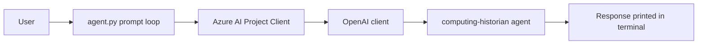

# Nine

Nine is a small AI agent project built around a first agent called computing-historian.

## Computing-Historian Agent

The computing-historian agent is the first AI agent in this project. It is set up to answer prompts through Azure AI Projects and a hosted agent reference named `computing-historian`.

It works like a tiny command-line wiki for historical computing questions: you type a prompt, the app sends it to the hosted agent, and the agent returns a response.

## Project Story

This project is the first step in building a family of AI agents. The computing-historian agent represents the starting point: a simple, focused assistant that can be extended later with memory, tools, or specialized prompt instructions.

The current version keeps the shape intentionally small so the flow is easy to understand:

1. Create an Azure AI Project client.
2. Open the default OpenAI client from that project.
3. Send user text to the `computing-historian` agent reference.
4. Print the response in the terminal.

### What it does

- Connects to an Azure AI Project endpoint.
- Uses the Azure OpenAI client exposed through the project client.
- Sends user prompts to the computing-historian agent reference.
- Prints the agent response in the terminal.

### Architecture



### Why the name matters

The name `computing-historian` suggests an agent that remembers, explains, and contextualizes the history of computing. That makes it a good anchor for future documentation or retrieval-style features, because the concept is easy to expand from a narrow first agent into a broader knowledge assistant.

### Project files

- [agent.py](agent.py) runs the prompt loop and calls the agent.
- [README.md](README.md) describes the project and how the agent is used.

### How to run

1. Install the Python dependency:

```bash
pip install azure-ai-projects>=2.0.0
```

2. Update the Azure project endpoint in [agent.py](agent.py).

3. Run the script:

```bash
python agent.py
```

4. Enter a prompt when prompted. Type `quit` to exit.

### Notes

- The agent name is `computing-historian`.
- The current version reference in the sample is `1`.
- Keep Azure credentials and endpoints out of the README if you publish the repository publicly.
- The sample is interactive, so it stays in a loop until you type `quit`.
